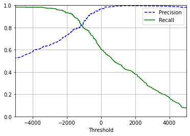
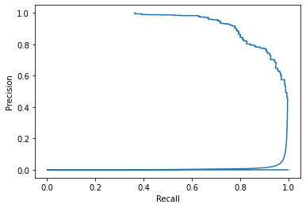

```python
# import the dataset
import pandas as pd
import numpy as np
master = pd.read_csv('cars.csv')

# Discard any categorical columns (can't easily be quantified)
master.drop(columns=['Engine Information.Engine Type', 'Identification.ID', 'Identification.Model Year'], axis=1, inplace=True)

master.shape
```


    (5076, 15)


```python
# Add features to the data – is the car efficient or not?

# Rename select keys more readable column names

df = master.copy()

df = df.rename(columns=
                       {
                            "Fuel Information.City mpg": "cityMpg",
                            "Fuel Information.Highway mpg": "highwayMpg",
                            "Dimensions.Height": "height",
                            "Dimensions.Length": "length",
                            "Dimensions.Width": "width",
                            "Engine Information.Engine Statistics.Horsepower": "horsepower",
                           "Engine Information.Hybrid": "isHybrid",
                           "Engine Information.Number of Forward Gears": "numberGears"
                       }
                      )

# Determine whether efficient or not
df['isCityEfficient'] = df.apply(lambda row: (row['cityMpg'] >= 22), axis=1)
df['isHighwayEfficient'] = df.apply(lambda row: (row['highwayMpg'] >= 22), axis=1)
df['isCombinedEfficient'] = df.apply(lambda row: (row['isCityEfficient'] & row['isHighwayEfficient']) , axis=1)

df.tail()
```


<div>
<style scoped>
    .dataframe tbody tr th:only-of-type {
        vertical-align: middle;
    }

    .dataframe tbody tr th {
        vertical-align: top;
    }

    .dataframe thead th {
        text-align: right;
    }
</style>
<table border="1" class="dataframe">
  <thead>
    <tr style="text-align: right;">
      <th></th>
      <th>height</th>
      <th>length</th>
      <th>width</th>
      <th>Engine Information.Driveline</th>
      <th>isHybrid</th>
      <th>numberGears</th>
      <th>Engine Information.Transmission</th>
      <th>cityMpg</th>
      <th>Fuel Information.Fuel Type</th>
      <th>highwayMpg</th>
      <th>Identification.Classification</th>
      <th>Identification.Make</th>
      <th>Identification.Year</th>
      <th>horsepower</th>
      <th>Engine Information.Engine Statistics.Torque</th>
      <th>isCityEfficient</th>
      <th>isHighwayEfficient</th>
      <th>isCombinedEfficient</th>
    </tr>
  </thead>
  <tbody>
    <tr>
      <th>5071</th>
      <td>13</td>
      <td>253</td>
      <td>201</td>
      <td>Front-wheel drive</td>
      <td>True</td>
      <td>5</td>
      <td>5 Speed Automatic</td>
      <td>18</td>
      <td>Gasoline</td>
      <td>25</td>
      <td>Automatic transmission</td>
      <td>Honda</td>
      <td>2012</td>
      <td>250</td>
      <td>253</td>
      <td>False</td>
      <td>True</td>
      <td>False</td>
    </tr>
    <tr>
      <th>5072</th>
      <td>141</td>
      <td>249</td>
      <td>108</td>
      <td>All-wheel drive</td>
      <td>True</td>
      <td>6</td>
      <td>6 Speed Manual</td>
      <td>12</td>
      <td>Gasoline</td>
      <td>20</td>
      <td>Manual transmission</td>
      <td>Lamborghini</td>
      <td>2012</td>
      <td>552</td>
      <td>398</td>
      <td>False</td>
      <td>False</td>
      <td>False</td>
    </tr>
    <tr>
      <th>5073</th>
      <td>160</td>
      <td>249</td>
      <td>108</td>
      <td>All-wheel drive</td>
      <td>True</td>
      <td>6</td>
      <td>6 Speed Manual</td>
      <td>12</td>
      <td>Gasoline</td>
      <td>20</td>
      <td>Manual transmission</td>
      <td>Lamborghini</td>
      <td>2012</td>
      <td>552</td>
      <td>398</td>
      <td>False</td>
      <td>False</td>
      <td>False</td>
    </tr>
    <tr>
      <th>5074</th>
      <td>200</td>
      <td>210</td>
      <td>110</td>
      <td>Rear-wheel drive</td>
      <td>True</td>
      <td>6</td>
      <td>6 Speed Automatic Select Shift</td>
      <td>17</td>
      <td>Gasoline</td>
      <td>25</td>
      <td>Automatic transmission</td>
      <td>BMW</td>
      <td>2012</td>
      <td>315</td>
      <td>330</td>
      <td>False</td>
      <td>True</td>
      <td>False</td>
    </tr>
    <tr>
      <th>5075</th>
      <td>200</td>
      <td>94</td>
      <td>110</td>
      <td>Rear-wheel drive</td>
      <td>True</td>
      <td>6</td>
      <td>6 Speed Automatic Select Shift</td>
      <td>17</td>
      <td>Gasoline</td>
      <td>25</td>
      <td>Automatic transmission</td>
      <td>BMW</td>
      <td>2012</td>
      <td>315</td>
      <td>330</td>
      <td>False</td>
      <td>True</td>
      <td>False</td>
    </tr>
  </tbody>
</table>
</div>


```python
# Determine features to include in dataset

# Remove any unneeded columns
df = df.drop([
    'Engine Information.Driveline',
    'Engine Information.Transmission',
    'Fuel Information.Fuel Type',
    'Identification.Classification',
    'Identification.Make',
    'Identification.Year',
    'Engine Information.Engine Statistics.Torque'
    ], axis=1)

dataset = df.copy()

dataset.tail()
```


<div>
<style scoped>
    .dataframe tbody tr th:only-of-type {
        vertical-align: middle;
    }

    .dataframe tbody tr th {
        vertical-align: top;
    }

    .dataframe thead th {
        text-align: right;
    }
</style>
<table border="1" class="dataframe">
  <thead>
    <tr style="text-align: right;">
      <th></th>
      <th>height</th>
      <th>length</th>
      <th>width</th>
      <th>isHybrid</th>
      <th>numberGears</th>
      <th>cityMpg</th>
      <th>highwayMpg</th>
      <th>horsepower</th>
      <th>isCityEfficient</th>
      <th>isHighwayEfficient</th>
      <th>isCombinedEfficient</th>
    </tr>
  </thead>
  <tbody>
    <tr>
      <th>5071</th>
      <td>13</td>
      <td>253</td>
      <td>201</td>
      <td>True</td>
      <td>5</td>
      <td>18</td>
      <td>25</td>
      <td>250</td>
      <td>False</td>
      <td>True</td>
      <td>False</td>
    </tr>
    <tr>
      <th>5072</th>
      <td>141</td>
      <td>249</td>
      <td>108</td>
      <td>True</td>
      <td>6</td>
      <td>12</td>
      <td>20</td>
      <td>552</td>
      <td>False</td>
      <td>False</td>
      <td>False</td>
    </tr>
    <tr>
      <th>5073</th>
      <td>160</td>
      <td>249</td>
      <td>108</td>
      <td>True</td>
      <td>6</td>
      <td>12</td>
      <td>20</td>
      <td>552</td>
      <td>False</td>
      <td>False</td>
      <td>False</td>
    </tr>
    <tr>
      <th>5074</th>
      <td>200</td>
      <td>210</td>
      <td>110</td>
      <td>True</td>
      <td>6</td>
      <td>17</td>
      <td>25</td>
      <td>315</td>
      <td>False</td>
      <td>True</td>
      <td>False</td>
    </tr>
    <tr>
      <th>5075</th>
      <td>200</td>
      <td>94</td>
      <td>110</td>
      <td>True</td>
      <td>6</td>
      <td>17</td>
      <td>25</td>
      <td>315</td>
      <td>False</td>
      <td>True</td>
      <td>False</td>
    </tr>
  </tbody>
</table>
</div>


```python
# Split dataset into training and test set
from sklearn.model_selection import train_test_split
```


```python

# Define our data and if they are efficient or not
# Train based of both mpg ratings, horsepower, and number of gears
data = dataset[['cityMpg', 'highwayMpg', 'horsepower', 'numberGears']].to_numpy()

labels = dataset['isCombinedEfficient'].to_numpy()
```


```python
X_train, X_test, y_train, y_test = train_test_split(
    data, 
    labels, 
    test_size=0.2,
    random_state=42
)
```


```python
from sklearn.linear_model import SGDClassifier
sgd_clf = SGDClassifier(random_state = 21)

sgd_clf.fit(X_train, y_train)
```


    SGDClassifier(random_state=21)


```python
_mpg = data[0]
sgd_clf.predict([_mpg])
```


    array([False])


```python
# Run model on the test data
from sklearn.model_selection import cross_val_score
cross_val_score(sgd_clf, X_train, y_train, cv=3, scoring='accuracy')
```


    array([0.91358936, 0.93643755, 0.93939394])


```python
# Evaluate model and make apporpriate changes
from sklearn.model_selection import cross_val_predict

labels_train_predict = cross_val_predict(sgd_clf, X_train, y_train, cv=3)

labels_train_predict
```


    array([ True, False, False, ..., False, False,  True])


```python
# Precision/Recall?

from sklearn.metrics import precision_score, recall_score
precision_score(y_train, labels_train_predict)
```


    0.9672897196261683


```python
recall_score(y_train, labels_train_predict)
```


    0.6043795620437956


```python
from sklearn.metrics import f1_score
f1_score(y_train, labels_train_predict)
```


    0.7439353099730458


```python
# Decide on the threshold
labelsScores = cross_val_predict(sgd_clf, X_train, y_train, cv=3, method='decision_function')

labelsScores
```


    array([   768.23375126,  -4511.96179359, -15301.68876479, ...,
            -5744.85449862,  -6381.12049478,   3534.45478393])


```python
# We can use theses cores with precision/recall to plot what the results would be with different thresholds
from sklearn.metrics import precision_recall_curve
precisions, recalls, thresholds = precision_recall_curve(y_train, labelsScores)
```


```python
# Plot

import matplotlib as mpl
import matplotlib.pyplot as plt

def plotPrecisionRecallThreshold(pre, rec, thr):
    plt.plot(thr, pre[:-1], 'b--', label='Precision')
    plt.plot(thr, rec[:-1], 'g-', label='Recall')
    plt.grid()
    plt.xlabel('Threshold')
    plt.legend()
    plt.axis([-5000,5000,0,1])
    
plotPrecisionRecallThreshold(precisions, recalls, thresholds)
plt.show()
```


    

    


```python
plt.plot(precisions, recalls)
plt.xlabel('Recall')
plt.ylabel('Precision')
plt.show()
```


    

    


```python
# Want 91% precision
threshold91Precision = thresholds[np.argmax(precisions>=.91)]
threshold91Precision
```


    -663.1249717147463


```python
labelsTrainPred91 = (labelsScores >= threshold91Precision)
labelsTrainPred91
```


    array([ True, False, False, ..., False, False,  True])


```python
precision_score(y_train, labelsTrainPred91)
```


    0.91005291005291


```python
recall_score(y_train, labelsTrainPred91)
```


    0.7532846715328467


```python

```
